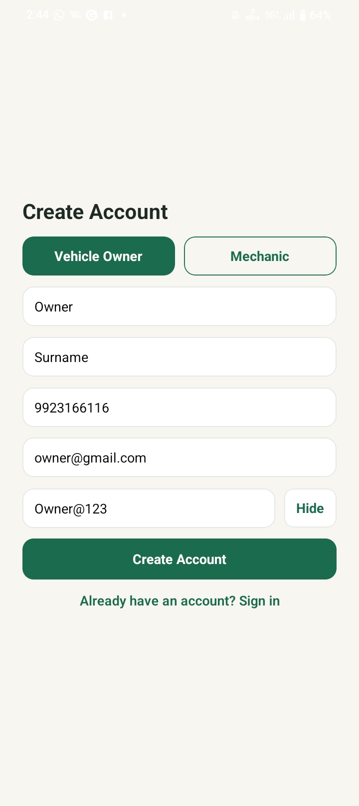
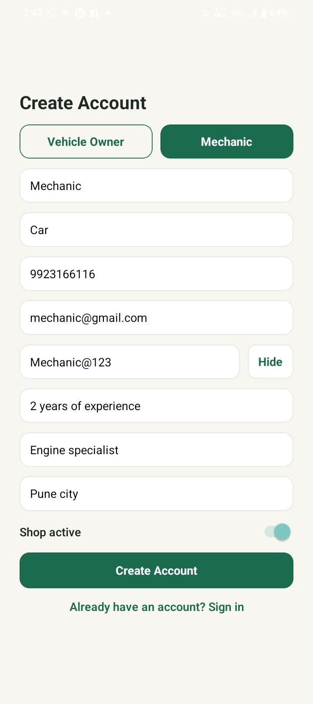
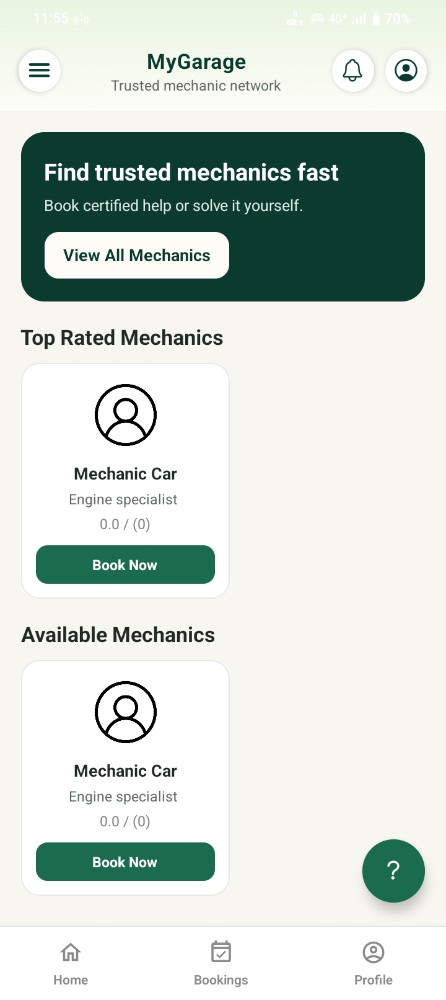
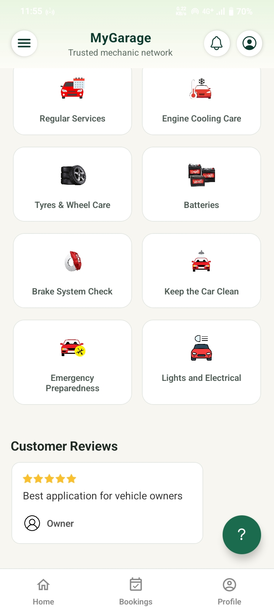
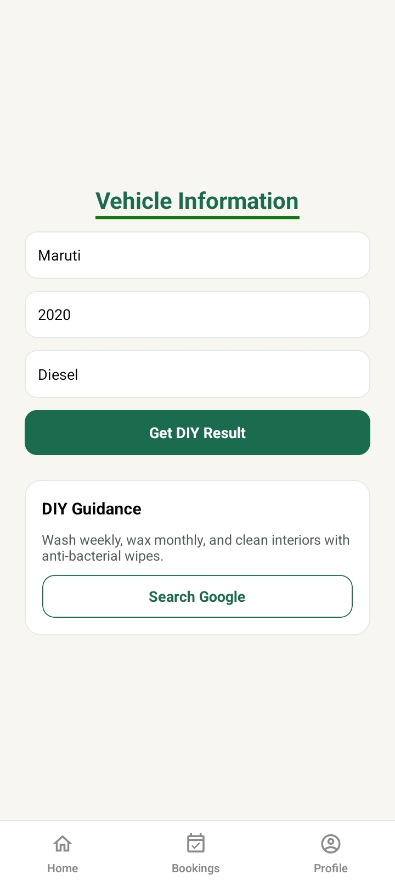
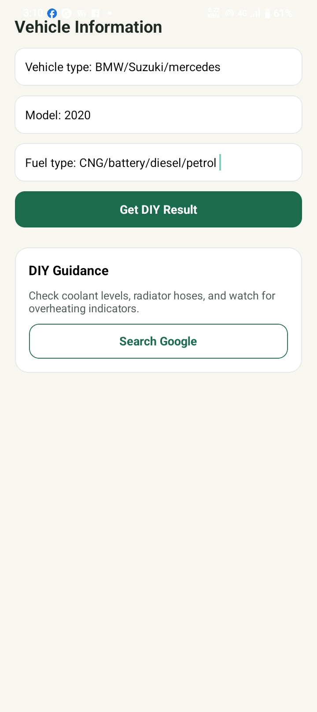
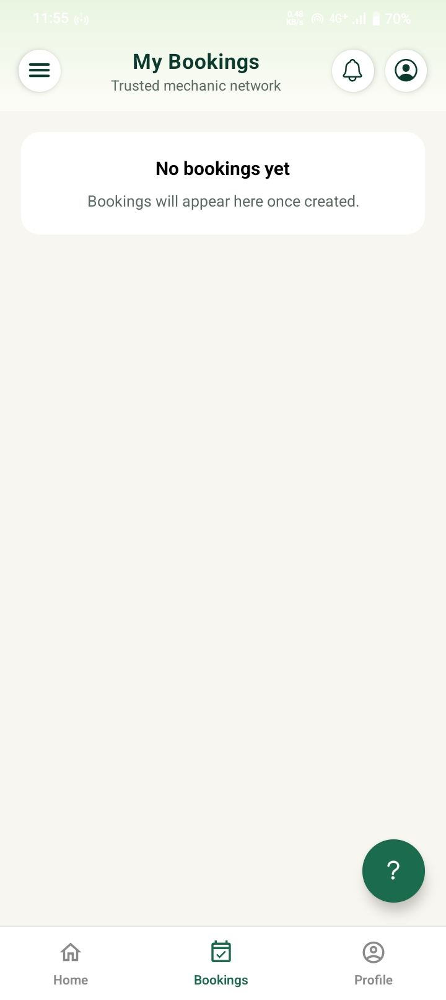

# MyGarageApp

MyGarage is a comprehensive mobile application designed to connect car owners with mechanics and provide DIY maintenance guides. Users can book various car services, track request statuses, rate mechanics, and access detailed instructions for common vehicle repairs. The app also features separate profiles for vehicle owners and mechanics, ensuring a tailored experience for each user type.

## 📱 Android App

Download the latest signed APK:  
👉 https://github.com/Umesh-gbmsofttech/MyGarage/releases/latest/

> Note: Enable “Install unknown apps” on your Android device.

# Welcome to your MyGarage👋

## 📸 App Screenshots

  
  

  
  

  
  

  
  <!--  -->

## Using Cron job website to keep alive render hosted server:

1.  https://console.cron-job.org/jobs